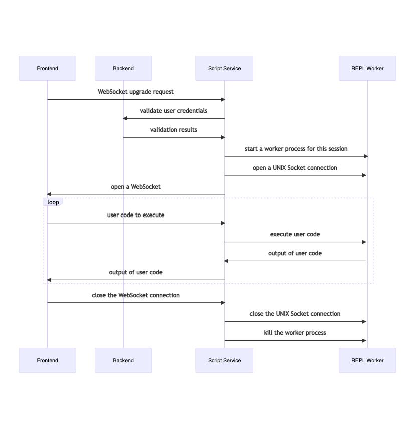
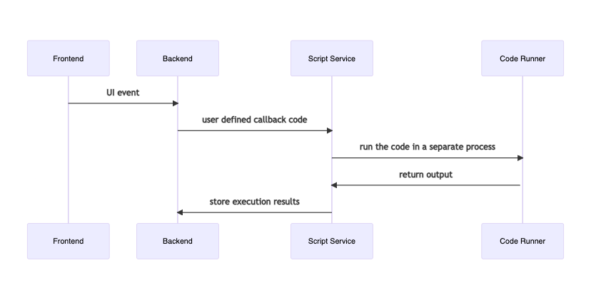

<!-- <script src="https://cdn.jsdelivr.net/npm/mermaid/dist/mermaid.min.js"></script>
<script>
  mermaid.initialize({startOnLoad:true});
</script> -->

# lambdee-board-script-service

A web server which acts as a service providing Ruby code execution through its REST API
and via WebSockets.

It provides an API for interacting with the main `lambdee-board` server
which is available for use in the scripts it executes.

## Setup

```sh
$ bundle
```

## Run

### Start the server

```sh
$ bin/dev
```

## Run tests

```shs
$ bin/test
```

## Architecture

### Lambdee Web Console

This server is responsible for live user code execution
in the Lambdee Web Console.

<!-- <div class='mermaid'>
sequenceDiagram
    participant Frontend
    participant Backend
    participant Script Service
    participant REPL Worker
    Frontend->>Script Service: WebSocket upgrade request
    Script Service->>Backend: validate user credentials
    Backend->>Script Service: validation results
    Script Service->>+REPL Worker: start a worker process for this session
    Script Service->>REPL Worker: open a UNIX Socket connection
    Script Service->>Frontend: open a WebSocket
    loop
        Frontend->>Script Service: user code to execute
        Script Service->>REPL Worker: execute user code
        REPL Worker->>Script Service: output of user code
        Script Service->>Frontend: output of user code
    end
    Frontend->>Script Service: close the WebSocket connection
    Script Service->>REPL Worker: close the UNIX Socket connection
    Script Service->>REPL Worker: kill the worker process
</div> -->



### Lambdee Automation Scripts/Callbacks

This server is responsible for executing user-defined
automation scripts/callbacks after certain UI events and scheduled ones.

<!-- <div class='mermaid'>
sequenceDiagram
    participant Frontend
    participant Backend
    participant Script Service
    participant Code Runner
    Frontend->>Backend: UI event
    Backend->>Script Service: user defined callback code
    Script Service->>+Code Runner: run the code in a separate process
    Code Runner->>Script Service: return output
    Script Service->>Backend: store execution results
</div> -->



## Problems
